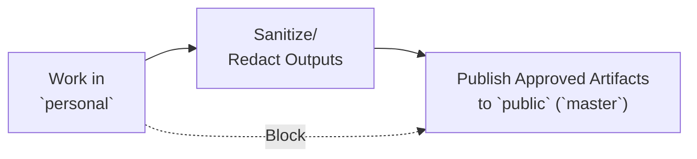

# Branch Workflow

## Purpose

Define a strict two-branch operating model that prevents private data leakage to public history.

## Branches

- `public` (`master`): public-facing branch for reusable assets.
- `personal`: private operating branch for real execution data.

## One-Way Data Flow

Data must move in a single direction:

1. Work in `personal`.
2. Sanitize/redact outputs.
3. Publish only approved artifacts to `public` (`master`).

Never move raw/private data directly from `personal` to `public`.



## Allowed Data by Branch

- `public` (`master`):
  - `public-reusable`
  - `derived-sanitized` (validated)
- `personal`:
  - `public-reusable`
  - `derived-sanitized`
  - `raw-ingest`
  - `private-sensitive`

If classification is unclear, mark as `NEEDS_REVIEW` and block public merge.

## Public Merge Gate

Before merging to `public` (`master`), all checks must pass:

- [ ] No `private-sensitive` files are staged.
- [ ] No `raw-ingest` files are staged.
- [ ] `derived-sanitized` files passed `docs/SANITIZATION_CHECKLIST.md`.
- [ ] Files follow `docs/DATA_CLASSIFICATION.md`.
- [ ] Decision mode result is documented:
  - `ALLOW_PUBLIC`
  - `REQUIRE_SANITIZATION`
  - `PRIVATE_ONLY`

Any failed check means no merge to `public`.

## Publishing `personal` to `master` (squash)

Use a **squash merge** when promoting work from `personal` to `master` so the public branch gets **one** combined commit instead of replaying every intermediate commit from `personal` (reduces accidental detail in public history).

**CLI (local):** `git checkout master` → `git merge --squash personal` → review staged diff → `git commit` with a single message. **GitHub:** open a PR and choose **Squash and merge**.

**`data/daily/` and `data/weekly/`:** These paths are **gitignored** and not tracked in the repo. Keep any planning files **only on your machine** for your `personal` workflow; they must not appear in the tree on `master`.

**After publishing:** On `personal`, run **`git merge master`** to bring the squashed commit into your branch and keep your working tree aligned with `master` for continued work.

## Recommended PR Flow

1. Prepare changes in `personal`.
2. Classify changed files using `docs/DATA_CLASSIFICATION.md`.
3. Sanitize and re-check content.
4. Open PR from a sanitized working branch to `public` (`master`).
5. Prefer **Squash and merge** (or local squash as in the section above).
6. Include validation notes and decision mode result in PR description.

## Release Flow

Releases are tagged on `master` after merging a release branch PR. For versioning rules, see **Semantic Versioning** in [`CHANGELOG.md`](../CHANGELOG.md) (line 5).

CHANGELOG format follows [keepachangelog v1.1.0](https://keepachangelog.com/en/1.1.0/): version headers use `## [X.Y.Z] - YYYY-MM-DD` (hyphen, not em-dash).

### Pre-Release Checklist

Before cutting a release, verify:

- [ ] No incomplete commits or TODOs on `master` since last version.
- [ ] All framework/governance changes documented in [`CHANGELOG.md`](../CHANGELOG.md) or `docs/`.
- [ ] No breaking data-flow or branch-workflow changes without coordination.

### Automated Release Workflows

Two GitHub Actions workflows handle the release process end-to-end.

#### Step 1 — Start Release

Run the **[Start Release](.github/workflows/release-start.yml)** workflow (`Actions → Start Release → Run workflow`) with the target version (e.g. `0.3.0`).

The workflow will:
1. Validate the version (semver format, tag not yet existing, branch not yet existing)
2. Fail fast if `[Unreleased]` is empty
3. Create branch `release/vX.Y.Z` from `master`
4. Update `CHANGELOG.md`: normalize all version headers to hyphen format, move `[Unreleased]` items into `## [X.Y.Z] - YYYY-MM-DD`, reset `[Unreleased]` to empty template
5. Commit `chore: prepare release vX.Y.Z` on the release branch
6. Open a PR from `release/vX.Y.Z` → `master` with release notes as PR body

#### Step 2 — Review and merge

Review the auto-opened PR. The PR body shows exactly what will be released. Merge when ready (regular merge or squash merge both work).

#### Step 3 — Tag and draft release (automatic)

When the PR is merged, the **[Tag & Draft Release](.github/workflows/release-tag.yml)** workflow triggers automatically and:
1. Creates an annotated tag `vX.Y.Z` on master HEAD
2. Pushes the tag to remote
3. Creates a **draft** GitHub Release with the `## [X.Y.Z]` CHANGELOG section as release notes

#### Step 4 — Publish release (manual)

Go to **Releases** on GitHub, open the draft, review the notes, and click **Publish release**. It will become the Latest release.

### Rollback (if tag is incorrect)

If you tag incorrectly, undo locally and on remote:

```bash
git tag -d vX.Y.Z                    # Delete local tag
git push origin --delete tag vX.Y.Z  # Delete remote tag
# Then re-run the Start Release workflow or use the manual alternative below
```

### Manual Alternative (fallback)

Use these steps if the automated workflows cannot run (e.g. branch protection blocking the bot):

1. Create `release/vX.Y.Z` from `master` and update `CHANGELOG.md` manually (move `[Unreleased]` → new versioned section, reset `[Unreleased]` template).
2. Commit `chore: prepare release vX.Y.Z`, push, open PR → `master`.
3. After merging, tag the commit:
   ```bash
   git tag -a vX.Y.Z -m "Release vX.Y.Z — see CHANGELOG.md for details"
   git push origin vX.Y.Z
   ```
4. Go to **Releases** on GitHub, create a release from tag `vX.Y.Z`, paste the `## [X.Y.Z]` section from `CHANGELOG.md` as release notes, save as draft, then publish.

### Notes

- All release tags are on `master`. Do not tag `personal`.
- Keep `[Unreleased]` in `CHANGELOG.md` for future work (do not delete).
- Version strings in code (if any) should match the tag (`vX.Y.Z`); update before triggering the workflow.
