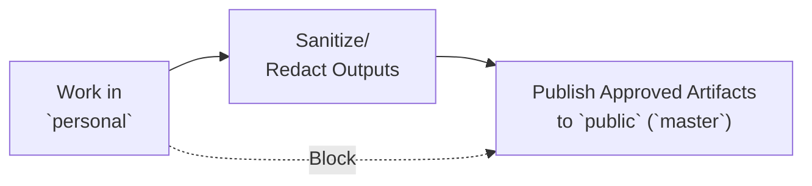

# Branch Workflow

## Purpose

Define a strict two-branch operating model that prevents private data leakage to public history.

## Branches

- `public` (`master`): public-facing branch for reusable assets.
- `personal`: private operating branch for real execution data.

## One-Way Data Flow

Data must move in a single direction:

1. Work in `personal`.
2. Sanitize/redact outputs.
3. Publish only approved artifacts to `public` (`master`).

Never move raw/private data directly from `personal` to `public`.

## Allowed Data by Branch

- `public` (`master`):
  - `public-reusable`
  - `derived-sanitized` (validated)
- `personal`:
  - `public-reusable`
  - `derived-sanitized`
  - `raw-ingest`
  - `private-sensitive`

If classification is unclear, mark as `NEEDS_REVIEW` and block public merge.

## Public Merge Gate

Before merging to `public` (`master`), all checks must pass:

- [ ] No `private-sensitive` files are staged.
- [ ] No `raw-ingest` files are staged.
- [ ] `derived-sanitized` files passed `docs/SANITIZATION_CHECKLIST.md`.
- [ ] Files follow `docs/DATA_CLASSIFICATION.md`.
- [ ] Decision mode result is documented:
  - `ALLOW_PUBLIC`
  - `REQUIRE_SANITIZATION`
  - `PRIVATE_ONLY`

Any failed check means no merge to `public`.

## Recommended PR Flow

1. Prepare changes in `personal`.
2. Classify changed files using `docs/DATA_CLASSIFICATION.md`.
3. Sanitize and re-check content.
4. Open PR from a sanitized working branch to `public` (`master`).
5. Include validation notes and decision mode result in PR description.
