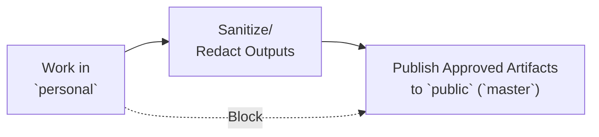

# Branch Workflow

## Purpose

Define a strict two-branch operating model that prevents private data leakage to public history.

## Branches

- `public` (`master`): public-facing branch for reusable assets.
- `personal`: private operating branch for real execution data.

## One-Way Data Flow

Data must move in a single direction:

1. Work in `personal`.
2. Sanitize/redact outputs.
3. Publish only approved artifacts to `public` (`master`).

Never move raw/private data directly from `personal` to `public`.

## Allowed Data by Branch

- `public` (`master`):
  - `public-reusable`
  - `derived-sanitized` (validated)
- `personal`:
  - `public-reusable`
  - `derived-sanitized`
  - `raw-ingest`
  - `private-sensitive`

If classification is unclear, mark as `NEEDS_REVIEW` and block public merge.

## Public Merge Gate

Before merging to `public` (`master`), all checks must pass:

- [ ] No `private-sensitive` files are staged.
- [ ] No `raw-ingest` files are staged.
- [ ] `derived-sanitized` files passed `docs/SANITIZATION_CHECKLIST.md`.
- [ ] Files follow `docs/DATA_CLASSIFICATION.md`.
- [ ] Decision mode result is documented:
  - `ALLOW_PUBLIC`
  - `REQUIRE_SANITIZATION`
  - `PRIVATE_ONLY`

Any failed check means no merge to `public`.

## Publishing `personal` to `master` (squash)

Use a **squash merge** when promoting work from `personal` to `master` so the public branch gets **one** combined commit instead of replaying every intermediate commit from `personal` (reduces accidental detail in public history).

**CLI (local):** `git checkout master` → `git merge --squash personal` → review staged diff → `git commit` with a single message. **GitHub:** open a PR and choose **Squash and merge**.

**`data/daily/` and `data/weekly/`:** These paths are **gitignored** and not tracked in the repo. Keep any planning files **only on your machine** for your `personal` workflow; they must not appear in the tree on `master`.

**After publishing:** On `personal`, run **`git merge master`** to bring the squashed commit into your branch and keep your working tree aligned with `master` for continued work.

## Recommended PR Flow

1. Prepare changes in `personal`.
2. Classify changed files using `docs/DATA_CLASSIFICATION.md`.
3. Sanitize and re-check content.
4. Open PR from a sanitized working branch to `public` (`master`).
5. Prefer **Squash and merge** (or local squash as in the section above).
6. Include validation notes and decision mode result in PR description.
